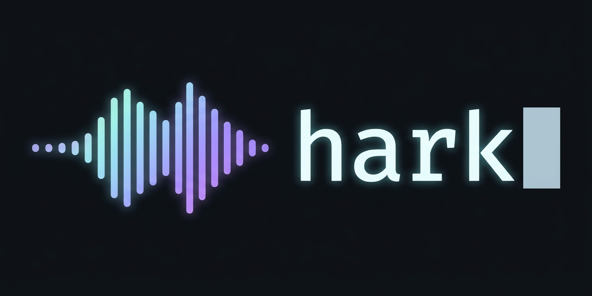

# hark

[](https://github.com/DRYCodeWorks/hark/actions/workflows/ci.yml)



Push-to-talk dictation into whatever has focus — most usefully a terminal
session reached over SSH or mosh, but really anywhere: Slack, a browser, any
text field. Hold **Ctrl+Alt+Space**, speak, release; the transcript lands on
the clipboard and is pasted at the cursor.

Transcription is local (whisper.cpp, model held resident). Audio never leaves
your hardware — there is no cloud ASR and no account.

macOS only, by construction: it is built out of launchd, AVAudioEngine,
Hammerspoon, and macOS's TCC permission model.

## Why off-the-shelf dictation apps can't do this

Every consumer dictation app (Wispr Flow, superwhisper, VoiceInk, Hex, Handy,
MacWhisper) injects text the same way: clipboard, then synthesize Cmd+V into
the frontmost app. That breaks for a remote terminal session, and Wispr Flow's
own docs say so outright:

> "Direct paste is not supported in WSL terminals, SSH sessions, tmux, or
> screen."

Their workaround is a manual "paste last transcript" hotkey — i.e. not
actually dictation-in-place. A shell or tmux keybinding can't substitute
either: agentic CLIs like Claude Code paint their own input box (there is no
readline buffer for a ZLE widget to hook), and any keybinding evaluated over
SSH runs on the *remote* host, which has no microphone.

`hark` sidesteps this instead of fighting it. Capture and paste happen on
the machine you are physically touching, so the pane you are looking at is
the pane that receives the text. Nothing has to guess a target.

## Architecture

The default is a single Mac: everything below runs on it, bound to loopback,
exposed to nothing.

```
⌃⌥Space held
  └─► rec (AVAudioEngine) records the mic → 16 kHz mono WAV
⌃⌥Space released
  └─► POST /dictate ─────────────►  hark  (HTTP service)
        X-Hark-Key                       │
        Content-Type: audio/wav          ├─► RMS energy gate (silence → "")
                                         ├─► whisper-server (model resident)
                                         └─► sanitize (collapse to one line)
                                    ◄── 200 {"text": "..."}
  ├─► put the text on the clipboard
  └─► synthesize ⌘V into the FOCUSED app
        │
        └─► terminal ──ssh/mosh──► tmux ──► the pane you're actually looking at
```

**Two machines is the same architecture with a different bind address.** If
you want a laptop to record while a desktop holds the model resident, point
the client at the desktop instead of at loopback — see "Two machines" below.
There is no separate mode.

The server does **not** try to guess which terminal pane to inject into, and
does not inject anything itself — it only returns the transcript. The design
spec's "REVISED" section explains why that guess (via `tmux list-clients` and
`client_activity`) turned out to be actively wrong rather than merely fragile:
the only available signal bumps on real keystrokes, so it tracks wherever you
last *typed*, in a tool built to stop you typing.

The clipboard is deliberately **not** restored after pasting: the transcript
stays there, so a misfired paste is recoverable with a manual ⌘V instead of
re-speaking. See the comment above `hs.pasteboard.setContents` in
`client/init.lua` for why this should not be "fixed" later.

## Install

```bash
git clone https://github.com/DRYCodeWorks/hark && cd hark
./install-server.sh     # transcription side
./install-client.sh     # hotkey, mic, paste
```

On one Mac, run both. On two, run `install-server.sh` on the machine that
holds the model and `install-client.sh` on the one you type at.

### 1. Server

`./install-server.sh` installs `whisper-cpp` and `uv` via Homebrew, downloads
a model (~1.5 GB, skipped if present), installs the `hark` package into
`~/.local/share/hark/venv`, generates the shared secret, renders both launchd
plists from your config, loads them, and waits for `/health`. It refuses to
report success if the service never answers.

**The clone is not load-bearing.** launchd runs the copy under
`~/.local/share/hark/venv`, by absolute path and with no `WorkingDirectory`, so
you can move or delete the checkout without breaking the service — and `git
pull` does not live-patch a running daemon. Upgrading is deliberate: pull, then
re-run `./install-server.sh`. The venv is rebuilt from scratch each time, so a
dependency you removed actually goes away.

The model is pinned to a specific upstream revision and verified against a
recorded SHA-256 before it is moved into place — not tracking a mutable
`main`, and not trusting a download that merely completed. To use a different
model, change `MODEL_REVISION` and `MODEL_SHA256` together.

It is safe to re-run, and re-running is how you apply a config change — it
re-renders and reloads.

| Service | Binds to | Logs |
|---|---|---|
| `com.drycodeworks.hark-whisper` | `127.0.0.1:8910` — loopback only, always | `/tmp/hark-whisper.log`, `/tmp/hark-whisper.err` |
| `com.drycodeworks.hark` | `127.0.0.1:8911` by default, never `0.0.0.0` | `/tmp/hark.log`, `/tmp/hark.err` |

`./install-server.sh --doctor` re-runs the checks alone, read-only.

The plists are **rendered from templates** in `launchd/`, never edited by
hand, because launchd reads its own XML and cannot see `config.py` — so the
two drift silently. `tests/test_launchd_config_sync.py` renders the templates
and asserts they agree with config, including that the ASR server is never
bound off loopback.

A wildcard bind is refused by `hark.plists` itself, not only by the test
suite — `install-server.sh` stops rather than installing a plist that listens
on every interface. Any other address is accepted, since the two-machine setup
binds to a private one on purpose.

The shared secret lives at `~/.config/hark/key` (mode 600), outside the repo.

### 2. Client

```bash
./install-client.sh
```

It:

1. installs `hammerspoon` (cask) via Homebrew if missing, and compiles
   `client/rec.swift` to `~/.hammerspoon/rec` with `swiftc`,
2. obtains the shared secret (locally, or over SSH for a two-machine setup),
3. asks you nothing about microphones — `rec` records the system default
   input, chosen in System Settings → Sound → Input,
4. curls `/health` and tells you plainly if the server isn't reachable,
5. writes `~/.hammerspoon/hark-config.lua` (mode 600 — it holds the secret
   in plaintext) and links `client/init.lua` to `~/.hammerspoon/init.lua`. If
   that path already exists as a real file rather than a symlink, this is a
   **hard stop** with the exact command to fix it, not a warning you can miss,
6. **actually starts Hammerspoon with the new config loaded** — launching it
   if it wasn't running, quitting and relaunching if it was. Hammerspoon does
   not auto-reload its config, and installing a cask does not run the app.
   This step being missing was once the entire cause of "holding the hotkey
   does nothing at all",
7. handles the two permissions below,
8. finishes by running the same live checks as `--doctor` and refuses to print
   "setup complete" if any fail.

Safe to re-run at any time; every step checks current state first.

#### Native agent (preview, opt-in)

There is a second client — a native Swift agent that does the same job without
Hammerspoon. It is not the default yet, and installing it changes nothing about
the Hammerspoon path:

```bash
./install-agent.sh          # build, install to ~/Applications, load at login
./install-agent.sh --doctor # read-only diagnosis
./install-agent.sh --uninstall
```

Why it exists: Accessibility is currently granted to Hammerspoon — a
general-purpose scriptable Lua runtime — and its config is a symlink into this
repo, so `git pull` changes what that grant covers without re-prompting. A
single-purpose bundle asks for the same permission with far less behind it.
See [issue #2](https://github.com/DRYCodeWorks/hark/issues/2).

**The two clients cannot both hold the hotkey.** `Ctrl+Alt+Space` is a
system-wide registration and exactly one process gets it; whichever starts
first wins and the other reports that it could not register. `install-agent.sh`
quits Hammerspoon for you unless you pass `--keep-hammerspoon`.

Migration is non-destructive in both directions. `~/.hammerspoon/hark-config.lua`
is read into `~/.config/hark/client.json` and never modified, so rolling back is
just `./install-agent.sh --uninstall` and relaunching Hammerspoon.

You will be prompted for Microphone and Accessibility again — TCC keys grants to
a code identity, and the agent is a different one from Hammerspoon. Until a
Developer ID certificate is in place the bundle is ad-hoc signed, which means
those grants survive until the binary changes and you re-grant after a rebuild.

### 3. Configuration

Everything is optional — the defaults are the working single-machine setup.
Copy `config.example.toml` to `~/.config/hark/config.toml` to change the
bind address, the model path, the silence threshold, or the vocabulary prompt.

The **vocabulary prompt** is the cheapest accuracy win available: proper nouns
and jargon that come back mangled usually come back correct once listed in
`whisper.prompt`. It ships empty, because one person's jargon is another
person's noise.

### `./install-client.sh --doctor`

Read-only — changes nothing, exits non-zero if anything is wrong. Run it any
time the hotkey stops working, instead of re-running the whole install:

- Hammerspoon.app installed
- Hammerspoon actually running
- `~/.hammerspoon/init.lua` is a symlink to this repo's `client/init.lua`
- `~/.hammerspoon/hark-config.lua` exists, is mode 600, has a non-empty key
- `rec` is built, and which binary `init.lua` would actually resolve
- Hammerspoon can reach the microphone — read from
  `~/.hammerspoon/.hark-mic-status`, the outcome `client/init.lua`'s own
  startup probe wrote. This is the only reliable signal: `--doctor`
  deliberately does **not** run its own probe, since that would test the
  *terminal's* microphone permission rather than Hammerspoon's — a different
  grant, and a confidently wrong PASS.
- the server's `/health` is reachable
- the key **actually authenticates** — it POSTs a tiny silent WAV to
  `/dictate` and checks the response isn't a 401

Each `FAIL` line names its exact fix.

`--doctor` does **not** check Accessibility. Only a real hotkey press confirms
that one.

## Two permissions the installer cannot grant for you

Both need a human click in System Settings — macOS doesn't allow a script to
flip either — but they work fundamentally differently, and `install-client.sh` handles
them differently on purpose. These two cost a full debugging session to
understand, so they are worth reading before you hit them.

1. **Accessibility** — needed for the global hotkey and for synthesizing the
   ⌘V paste. Without it, `hs.hotkey.bind` silently never fires: no error, no
   console message, nothing. This one **is** pre-grantable — the Accessibility
   pane has a "+" button and lists every installed app whether or not it has
   ever run — so `install-client.sh` opens the pane and blocks until you confirm.

2. **Microphone** — `rec` runs as Hammerspoon's *child process*, so macOS
   attributes microphone access to **Hammerspoon**, not to `rec`. This one is
   **not** pre-grantable: the Microphone pane has **no "+" button**. Unlike
   Accessibility, it lists only apps that have *already requested* access.
   Hammerspoon will not appear there — there is nothing to toggle — until
   something has actually tried to open the mic.

   So permission must be **triggered**, never pre-granted. `client/init.lua`
   runs a short (~0.4s) `rec` probe on every config load, which is what fires
   the consent dialog. On success it stays silent and writes `ok` to
   `~/.hammerspoon/.hark-mic-status`; on failure it shows a long-lived
   alert, writes `denied`, and logs `rec`'s stderr. Once the probe has run
   once, Hammerspoon **is** listed in the Microphone pane, so the recovery
   path works.

Then test for real: put your cursor at a shell prompt, hold **Ctrl+Alt+Space —
all three keys together, not the spacebar alone**, say a short sentence,
release. The sentence should appear at the prompt within a couple of seconds,
**not executed**.

## Two machines

Useful when the Mac you type on can't spare 1.5 GB for a resident model.

On the transcribing machine, set the bind address in
`~/.config/hark/config.toml` to a private address it is reachable at —
a Tailscale/tailnet IP, a VPN address, or a LAN address you trust — then
re-render and reload the plists:

```toml
[server]
bind = "10.x.x.x"     # never 0.0.0.0
```

On the recording machine, point `server` in
`~/.hammerspoon/hark-config.lua` at the same address. `install-client.sh` will offer
to fetch the key over SSH.

`whisper.host` stays loopback in both cases and is not configurable. It is the
component that handles raw audio, and audio should not cross a network even a
trusted one.

## Changing the hotkey

Edit the last real line of `client/init.lua`:

```lua
hs.hotkey.bind({ "ctrl", "alt" }, "space", startRecording, stopRecording)
```

Hammerspoon accepts the standard modifier names (`"cmd"`, `"alt"`, `"ctrl"`,
`"shift"`, `"fn"`) and most key names as lowercase strings. Reload
Hammerspoon's config after editing (menu bar icon → Reload Config).

Avoid `{"cmd","alt"}` + `"space"` — that's macOS's Finder search shortcut, and
the system wins that fight before Hammerspoon sees the event.

The Fn/🌐 key needs a different mechanism entirely (an `hs.eventtap` watching
`flagsChanged`, the Input Monitoring permission, and disabling the system's own
Fn action). It is **not** a drop-in change to the `bind` call above.

## Troubleshooting

**Start here, every time:** `./install-client.sh --doctor`. Most "nothing
happens" reports are one of its checks, not a deeper bug.

0. **Nothing happened, but `--doctor` passes everything.** Check you're
   pressing **Ctrl+Alt+Space — all three keys together**. Then open the
   Hammerspoon console (menu bar icon → Console) and look for a Lua error.
   If Accessibility is missing, the hotkey silently never fires.
1. **`/tmp/hark.wav` is zero bytes, or the microphone check FAILs.** A
   microphone permission problem almost every time: System Settings → Privacy
   & Security → Microphone → Hammerspoon must be ON. If Hammerspoon isn't
   listed at all, it hasn't asked yet — reload its config to re-run the probe.
2. **A beep and an alert naming an HTTP status.** The alert names the likely
   cause:
   - **401** — the key in `~/.hammerspoon/hark-config.lua` doesn't match
     `~/.config/hark/key` on the server. Re-run `install-client.sh`.
   - **415** — a client bug in the `Content-Type` header; shouldn't happen
     with an unmodified `init.lua`.
   - **400** — the server rejected the audio; usually the same mic-permission
     issue as #1, caught server-side.
   - **503** — `whisper-server` is down. Check `/tmp/hark-whisper.err`.
   - **Negative status / can't reach the server** — connection failure. Check
     the network path and `launchctl list | grep hark`.
3. **The server side looks broken.** `tail -f /tmp/hark.log` and
   `/tmp/hark.err` (server errors, and the length — never the content —
   of each transcript); `/tmp/hark-whisper.err` for ASR crashes.
4. **It "works" but pastes nothing and says "heard nothing."** Not a bug: the
   audio was too quiet to clear the energy gate. Whisper hallucinates
   confident short phrases — famously "Thank you." — on silence, so this is
   filtered on the *audio*, not on the text. Speak louder or closer, check the
   input device, and see `SILENCE_RMS_THRESHOLD` below.

**`~/.hammerspoon/hark.log` is the load-bearing diagnostic.** Hammerspoon's
`print()` reaches only the in-app console, which is not persisted and cannot be
read out of band — a flake an hour old otherwise leaves zero evidence anywhere.
`init.lua` appends `rec`'s exit code and stderr to that file on every non-zero
exit.

## What's been tested, and what hasn't

One person, one pair of Macs, one microphone. CI runs the server suite (67
pytest), the client suite (8 Lua tests against a stubbed Hammerspoon) and
shellcheck, on both Linux and macOS. What CI cannot reach is everything the
permissions model touches — a real microphone, a real TCC grant, a real paste
into a real window. Specifically worth knowing:

**The silence threshold is calibrated against synthetic audio, not a real
microphone.** `SILENCE_RMS_THRESHOLD = 150.0` sits ~16× above the noise floor
that produces hallucinated text and ~21× below normal speech, measured with
`say`-generated audio. It has not misfired in real use, but a different mic in
a different room may need a different number. `hark` logs the measured rms
on every request precisely so you can calibrate from evidence instead of
guessing. Aim for ~500+ for headroom.

A related trap: **a call app that "hears you fine" is not proof your mic level
is adequate.** Zoom and Meet apply their own automatic gain; `rec` reads the
raw device with none, so an interface with a hardware gain knob may need it
turned up.

**First-word clipping.** Device-open latency, measured launch to first
captured sample:

| recorder | lead-in |
|---|---|
| `ffmpeg -f avfoundation` | ~1020–1365 ms |
| `rec` (AVAudioEngine) | ~670 ms |

670 ms is still enough to swallow a fast first word if you speak immediately on
key-down. The remaining lever is pre-warming — keeping an audio engine running
and only opening the file on key-down would cut this to near zero, at the cost
of holding the microphone open (and lighting the menu-bar mic indicator)
continuously. Not built: the privacy trade is real and should be a deliberate
choice rather than a default.

**End-to-end latency** has not been measured rigorously. If it feels
consistently above ~2 seconds, the next lever is a faster model (Parakeet TDT
benchmarks better than Whisper on both speed and accuracy), not
micro-optimizing this pipeline.

### Why capture is not ffmpeg

Worth recording, because it cost a full session and the failure looked random.

`ffmpeg -f avfoundation` failed to record roughly half the time, with:

```
[avfoundation @ 0x…] audio format is not supported
```

ffmpeg's avfoundation input accepts only **packed** sample layouts — f32, or
signed 16/24/32-bit. Some interfaces offer exactly one physical layout at every
one of their sample rates: *24-bit signed, unpacked in 4 bytes, high-aligned*.
ffmpeg cannot consume that at all.

It worked half the time because CoreAudio sometimes hands a capture client the
device's **virtual** format (Float32, converted by the HAL) instead of its
physical one, and which you get varies per open. Confirmed by diffing the
CoreAudio unified log across a failing and a succeeding run — the failing one
builds a converter targeting 24-bit unpacked and errors; the succeeding one
stays Float32. Nothing else distinguished them.

Nothing on the ffmpeg side fixes this: the avfoundation demuxer exposes no
audio-format option (every knob it has is video-side), there is no packed
format on the hardware to pin to, and avfoundation is ffmpeg's only macOS input
backend. `AVAudioEngine`'s `inputNode` is Float32 by contract, so
`client/rec.swift` cannot hit this failure mode.

The first fix attempted — retry ffmpeg when it dies early — was wrong. A
relaunch renegotiates the same format. Intermittent is not the same as
transient.

## Repo layout

```
install-server.sh          transcription side: deps, model, plists, services
install-client.sh          hotkey/mic/paste side, plus --doctor
install-agent.sh           native agent install/doctor/uninstall (preview)
client/
  init.lua                 Hammerspoon client
  rec.swift                AVAudioEngine recorder, built at install time
  hark-config.example.lua  shape of ~/.hammerspoon/hark-config.lua
  agent/
    hark-agent.swift       native client — hotkey, capture, POST, paste
    Info.plist             bundle identity + microphone usage string
    build-agent.sh         assembles and signs hark.app
config.example.toml        shape of ~/.config/hark/config.toml
src/hark/                  the HTTP service
launchd/                   plist templates, rendered by hark.plists
tests/                     pytest suite + test_client_record.lua (8)
.github/workflows/ci.yml   both suites + shellcheck + the agent build
docs/                      design spec + implementation plan
```

Run the suites locally the way CI does:

```bash
uv run --locked pytest -q
lua tests/test_client_record.lua
shellcheck install-server.sh install-client.sh install-agent.sh \
           client/agent/build-agent.sh
./client/agent/build-agent.sh          # macOS only
```

## License

MIT. See [LICENSE](LICENSE).
